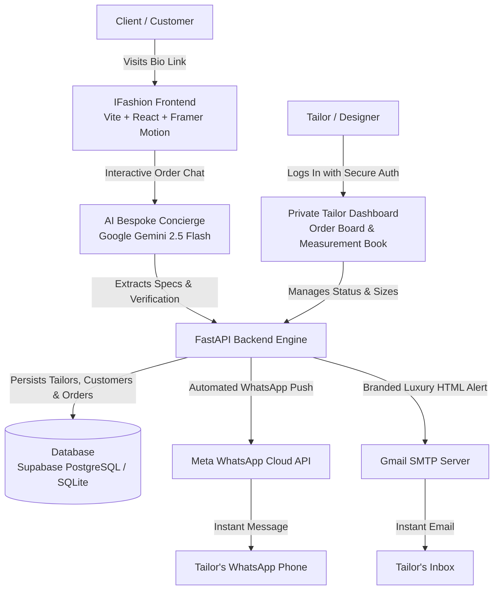

# IFASHION — Multi-Tenant Bespoke Fashion Operating Platform

A high-end, multi-tenant digital atelier platform connecting independent fashion designers and bespoke tailors with clients worldwide — featuring an AI sizing assistant, real-time Meta WhatsApp Cloud notifications, and an automated digital measurement book.

---

## Executive Summary

In bespoke African fashion (Agbadas, Senator suits, luxury Kaftans, and contemporary Ankara), tailors and designers typically take orders through fragmented WhatsApp chats, lose customer measurements in physical paper notebooks, and deal with endless back-and-forth messaging.

IFashion transforms any fashion designer's business into an automated, high-end digital atelier in 60 seconds:
1. Personalized Atelier Bio Links: Tailors register their brand and receive a custom bio link (`ifashion.ng/?designer=your-brand`) to share across Instagram, TikTok, and WhatsApp.
2. Zero-Friction AI Concierge: Customers chat naturally with an elite AI fashion assistant powered by Google Gemini, discuss fabric preferences, choose fulfillment (in-person atelier pickup or courier delivery), and save their measurements without needing to create an account or remember passwords.
3. Automated Cloud Notifications: As soon as an order is confirmed, the tailor instantly receives an automated WhatsApp Cloud Push and a branded HTML email with complete customer specifications and measurements.
4. Private Tailor Portal & Size Book: Tailors manage orders through visual Kanban stages (New Orders, Measuring, Cutting, Sewing, Ready, Delivered) and access customer measurements anytime for repeat business.

---

## System Architecture



---

## Key Modules & Capabilities

### 1. Multi-Tenant Atelier Storefronts
* Dynamic Storefront Routing: When a client visits `/?designer=needlecraft`, the entire platform adapts to show the tailor's brand name, bio, location, and specialties.
* 1-Click Shareable Bio Link: Tailors can copy their unique atelier link directly from their dashboard to paste into social bios.

### 2. Conversational AI Concierge (Gemini 2.5 Flash)
* Natural Dialogue: Welcomes customers, discusses styles (Agbada, Senator suits, Kaftans, native trousers), fabric types, and color palettes.
* Fulfillment Capture: Automatically captures whether the client prefers in-person atelier pickup or dispatch rider delivery (including destination street address).
* Strict Order Verification: Before finalizing an order, the AI provides a full recap (Style, Color, Measurements, Deadline, and Fulfillment) and sets `order_ready: true` only after explicit client confirmation.
* Returning Client Memory: Clients are recognized by their WhatsApp phone number. The AI greets them by name and recalls their previously saved body measurements without login friction.

### 3. Dual-Channel Cloud Notification Engine
* Meta WhatsApp Cloud API: Automatically delivers an order breakdown directly to the tailor's registered WhatsApp phone number via official Meta Cloud APIs.
* Rich HTML Email Notifications: Delivers a luxury, branded HTML email containing client details, full anatomical measurements table, fulfillment details, and a 1-click button to open the dashboard.
* Direct 1-Click WhatsApp Link: Generates a pre-filled `https://wa.me/` link so the tailor can initiate contact with the client with a single tap.

### 4. Private Tailor Dashboard & Digital Measurement Book
* Lifecycle Order Tracking: Tailors update orders across standard tailoring stages:
  * `received` (New Orders)
  * `measuring` (Size Confirmation)
  * `cutting` (Fabric Cut)
  * `stitching` (Sewing in Progress)
  * `ready` (Ready for Pickup / Dispatch)
  * `delivered` (Fulfilled)
* Customer Measurement Archive: Searchable database of customer size profiles (chest, waist, shoulder, sleeve length, trouser length, neck) accessible anytime.
* Profile Management: Update brand name, phone number, physical address, and specialty bio.

### 5. High-Fashion Editorial Gallery & Anatomical Fit Guide
* Pinterest-Grade Editorial Lookbook: High-fashion photography featuring bespoke Nigerian menswear (Royal Agbada, Minimalist Senator Suits, Luxury Silk Kaftans, and Contemporary Ankara).
* Interactive Category Filtering: Filter lookbook items instantly by style (All Styles, Agbada, Senator Suits, Kaftan, Trousers, Ankara).
* Visual Fit Visualizer: Interactive guide showing clients exactly where and how body measurements are taken.

---

## Repository Structure

```text
IFashion/
├── backend/
│   ├── api/
│   │   └── index.py            # Vercel serverless entrypoint
│   ├── app/
│   │   ├── models/
│   │   │   └── models.py       # SQLAlchemy ORM (Designer, Customer, Order)
│   │   ├── routers/
│   │   │   ├── auth.py         # Tailor registration, login & profiles
│   │   │   ├── chat.py         # AI assistant & order creation router
│   │   │   ├── customers.py    # Customer search & measurement management
│   │   │   └── orders.py       # Order listing, filtering & status transitions
│   │   ├── schemas/
│   │   │   └── schemas.py      # Pydantic v2 validation models
│   │   ├── database.py         # Dual-dialect DB engine (PostgreSQL + SQLite)
│   │   ├── notifications.py    # Meta WhatsApp Cloud API & SMTP email engine
│   │   └── main.py             # FastAPI application root & CORS setup
│   ├── .env.example            # Environment variable template
│   ├── requirements.txt        # Production dependencies
│   └── vercel.json             # Vercel deployment configuration
├── frontend/
│   ├── public/
│   │   └── images/             # Editorial bespoke fashion imagery
│   ├── src/
│   │   ├── components/
│   │   │   ├── AdminModal.jsx          # Tailor dashboard
│   │   │   ├── AuthModal.jsx           # Tailor login & registration modal
│   │   │   ├── ChatWidget.jsx          # AI conversational ordering drawer
│   │   │   ├── MeasurementPreview.jsx  # Interactive anatomical fit guide
│   │   │   └── TapeDivider.jsx         # site's tape divider design
│   │   ├── App.jsx             # Main storefront, hero, gallery & state
│   │   ├── App.css             #  warm ivory/espresso CSS tokens
│   │   └── main.jsx            # React root mount
│   ├── package.json            # Frontend dependencies (React, Vite, Framer Motion)
│   └── vercel.json             # Vercel SPA routing rewrite rules
└── .gitignore                  # Root Git ignore protecting secrets & databases
```

---

## API Reference

### 1. Authentication & Tailor Profiles (`/auth`)
| Method | Endpoint | Description | Auth Required |
| :--- | :--- | :--- | :--- |
| `POST` | `/auth/register` | Register a new tailor profile with strict password validation | No |
| `POST` | `/auth/login` | Authenticate tailor and receive session token | No |
| `GET` | `/auth/me` | Fetch logged-in tailor's private profile | Yes (Bearer Token) |
| `PATCH`| `/auth/profile` | Update brand name, phone, bio, address, or Instagram | Yes (Bearer Token) |
| `GET` | `/auth/designers` | Directory of public ateliers on the platform | No |
| `GET` | `/auth/designer/{handle}` | Fetch a specific tailor's public profile by handle | No |

### 2. Conversational Order Chat (`/chat`)
| Method | Endpoint | Description |
| :--- | :--- | :--- |
| `POST` | `/chat/` | Send client conversation history to Gemini 2.5 Flash, verify order recap, create order in DB, and trigger cloud push notifications |

### 3. Order Management (`/orders`)
| Method | Endpoint | Description |
| :--- | :--- | :--- |
| `GET` | `/orders/` | List orders (filter by `designer_id`, `status`, or `customer_id`) |
| `GET` | `/orders/{id}` | Get complete order details with customer measurements |
| `PATCH`| `/orders/{id}/status` | Transition order status (`received`, `cutting`, `stitching`, `ready`, `delivered`) |

### 4. Customers & Measurements (`/customers`)
| Method | Endpoint | Description |
| :--- | :--- | :--- |
| `GET` | `/customers/search` | Search client size book by name or phone |
| `GET` | `/customers/{phone}` | Fetch customer measurements by phone number |
| `PATCH`| `/customers/{id}` | Update customer measurement sheet |

---

## Environment Variables

### Backend (`backend/.env`)
```env
# AI Concierge Key (Google AI Studio)
GEMINI_API_KEY=my-api-key

# Production Database (Supabase PostgreSQL)
DATABASE_URL=my-db-password

# Email Push Notifications (Gmail SMTP / 16-character App Password)
SMTP_HOST=smtp.gmail.com
SMTP_PORT=587
SMTP_USER=configured_email@gmail.com
SMTP_PASSWORD=my_16_character_app_password
DESIGNER_EMAIL=my-email@gmail.com

# Meta WhatsApp Cloud API
WHATSAPP_CLOUD_API_TOKEN=my_meta_access_token
WHATSAPP_PHONE_NUMBER_ID=my_meta_phone_number_id
DESIGNER_PHONE=my-phone-number

# Production CORS
FRONTEND_URL=https://my-frontend.vercel.app
```

### Frontend (`frontend/.env`)
```env
# URL of your running backend
VITE_API_BASE=http://127.0.0.1:8000
```

---

## Local Development Setup

### 1. Prerequisites
* Python 3.10+ installed
* React.js installed

### 2. Backend Setup
```bash
# Navigate to backend directory
cd backend

# Create and activate virtual environment
python -m venv venv
.\venv\Scripts\activate       # Windows PowerShell
source venv/bin/activate      # Mac/Linux

# Install dependencies
pip install -r requirements.txt

# Start FastAPI development server
uvicorn app.main:app --reload --port 8000
```
API docs available at:`http://127.0.0.1:8000/docs`

### 3. Frontend Setup
```bash
# Open a new terminal in frontend directory
cd frontend

# Install dependencies
npm install

# Start Vite development server
npm run dev
```
Frontend running at: `http://localhost:5173`

---

## License & Credits
* Built with pride for African fashion creators and bespoke designers.
* Powered by Google Gemini, FastAPI, React, and Meta WhatsApp Cloud.
